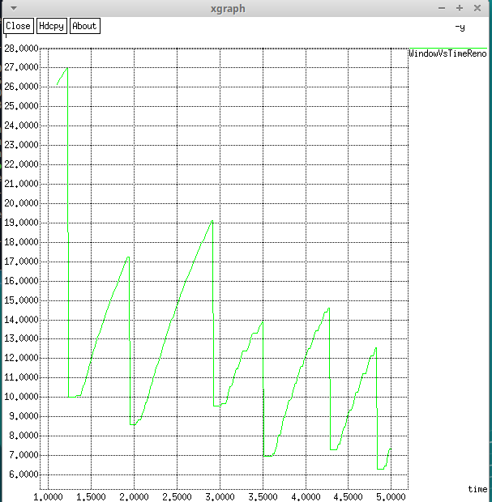
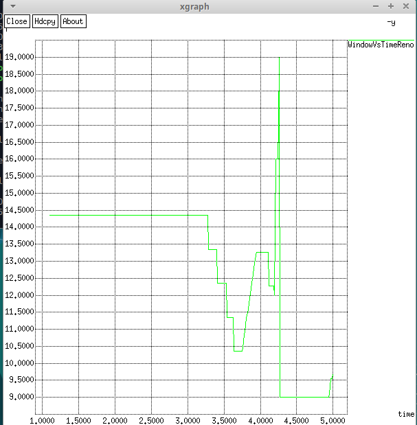

---
## Front matter
title: "Отчет по лабораторной работе 2"
subtitle: "Исследование протокола TCP и алгоритма управления очередью RED "
author: "Шалыгин Георгий Эдуардович"

## Generic otions
lang: ru-RU
toc-title: "Содержание"

## Bibliography
bibliography: bib/cite.bib
csl: pandoc/csl/gost-r-7-0-5-2008-numeric.csl

## Pdf output format
toc: true # Table of contents
toc-depth: 2
lof: true # List of figures
lot: true # List of tables
fontsize: 12pt
linestretch: 1.5
papersize: a4
documentclass: scrreprt
## I18n polyglossia
polyglossia-lang:
  name: russian
  options:
	- spelling=modern
	- babelshorthands=true
polyglossia-otherlangs:
  name: english
## I18n babel
babel-lang: russian
babel-otherlangs: english
## Fonts
mainfont: PT Serif
romanfont: PT Serif
sansfont: PT Sans
monofont: PT Mono
mainfontoptions: Ligatures=TeX
romanfontoptions: Ligatures=TeX
sansfontoptions: Ligatures=TeX,Scale=MatchLowercase
monofontoptions: Scale=MatchLowercase,Scale=0.9
## Biblatex
biblatex: true
biblio-style: "gost-numeric"
biblatexoptions:
  - parentracker=true
  - backend=biber
  - hyperref=auto
  - language=auto
  - autolang=other*
  - citestyle=gost-numeric
## Pandoc-crossref LaTeX customization
figureTitle: "Рис."
tableTitle: "Таблица"
listingTitle: "Листинг"
lofTitle: "Список иллюстраций"
lotTitle: "Список таблиц"
lolTitle: "Листинги"
## Misc options
indent: true
header-includes:
  - \usepackage{indentfirst}
  - \usepackage{float} # keep figures where there are in the text
  - \floatplacement{figure}{H} # keep figures where there are in the text
---

# Цель работы

Изучение протокола TCP и алгоритма управления очередью RED.

# Задание

1. Запустить симуляцию для предложенной в примере сети.
1. Изменить в модели на узле s1 тип протокола TCP с Reno на NewReno, затем на Vegas. Сравните и поясните результаты.
1. Внести изменения при отображении окон с графиками (измените цвет фона, цвет траекторий, подписи к осям, подпись траектории в легенде).

# Выполнение лабораторной работы

1. Опишем первую симуляцию(@fig:001).

   {#fig:001 width=70%}

   Здесь:

   - создаются 6 узлов
   - между ними определяются дуплексные соединения
   - определяется лимит очереди на соединении r1-r2
   - создаются tcp/Reno агенты и ftp поверх

   

   {#fig:002 width=70%}

   Здесь: 

   - описывается запись данных в файл
   - задаются события симуляции
   - процедуры finish, где создаются два файла для сохранения значений скользящего среднего размера очереди и абсолютных его значений.

   {#fig:003 width=70%}

   Здесь задаются параметры для xghraph в соотв. файле и происходит вызов отрисовки.

2. Получим графики (@fig:004, @fig:005)

   {#fig:004 width=70%}

   {#fig:005 width=70%}

   Видим мгновенное изменение размера очереди (красным) и скользящее среднее (зеленым) (оно остается примерно на уровне 3). На нижнем графике отображено изменение размера окна, он совершает резкие падения и плавные линейные скачки.

3. Изменим код отображения (fig:006, fig:007):

    {#fig:006 width=30%}

    {#fig:007 width=70%}

4.  Изменим тип протокола на Reno (@fig:008).

    {#fig:008 width=70%}

5. Построим графики (@fig:009).

    {#fig:009 width=70%}

    

    {#fig:0010 width=70%}

    Как видим, изменений практически нет.

    

6.  Изменим тип протокола на Vegas (@fig:011).

    {#fig:011 width=70%}

7. Построим графики (@fig:012).

    {#fig:012 width=70%}

    

    {#fig:013 width=70%}

    Как видим, здесь размер окна сначала остается неизменным , затем совершает резкие колебания. Скользящее среднее изначально меньше чем для Reno, однако со временем возрастает до аналогичного уровня.

    

# Выводы

В итоге были рассмотрены протоколы tcp и тип управления очередью red. А также средство Xgraph.
